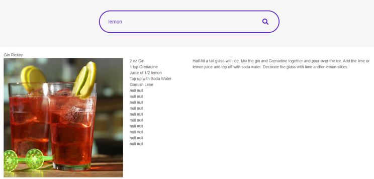

# The Dinner Party App

### A website allows users to search with an ingredient, and returns a random meal or drink recipe for user to use and the search history will be saved.

---

## Motivation for development
* Helping users to be more creative with their dinner party meals and drinks.
* Generating fun and surprise factor with the random recipes.

 ---

## User story
* As a dinner party planner, I want an App that allows me to type in an ingredient and show a random recipe for a meal or a drink each time.
* The recipe should contain the name, an image, all required ingredients, and the preparing instruction of the meal or the drink, so I know what I can make with the ingredients I have, or what ingredients I will need to buy.
* I want to see the searched history for future use.

---

## Technologies used
### This app uses HTML, CSS, and JavaScript.
### Third party API (jQuery, and bulma) were used, and Server-side API were also utilised to call the results.

---

## Breakdown of tasks and roles
* Sean: Meals JS coding, presentation preparation.
* Tyson: CSS stylesheets, HTML designs and coding.
* Wenyan: Cocktail JS coding, presentation preparation.
* ### Special Note: most of the sections were completed in a combined effort as a team.

---

### This Dinner Party App demostrate below functionalities:

1. Users can search by any ingredient,
2. Once hit the "Search" button or enter, it will return the result to show a random recipe which contains the ingredient,
3. It will show the name of the dish or drink, an image, all required ingredients, and the instructions to prepare the meal or drink,
4. The search results can be saved in the local storage by clicking the "Save Recipe" button

---

### This project has been deployed to GitHub Pages and the link is as below

## [The Dinner Party](https://seanbutcher1994.github.io/The-Dinner-Party/index.html)

### - The cover page is shown as below

---

### - Enter the ingredient and hit the "Search" button in the meal page

### - A random dish will show up

### - Enter the ingredient and hit the "Search" button in the cocktail page

### - A random dish will show up

### - the "Save Recipe" button under both pages can let users to save any dish in the local storage

